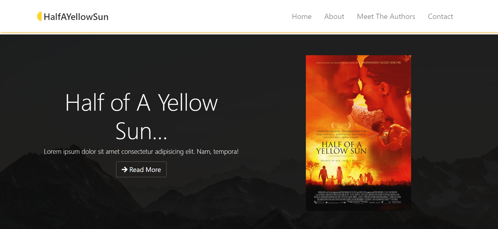

# yellow-sun-book-theme

This is is single page website styled with bootstrap only. It is a place where you can get more additional info about a newly released book called <Half A Yellow Sun>, It also shows the authors involved in creating this book.

## Preview

This website is fully responsive to all devices. Be sure to give a star if you like it.

## Built With

- HTML 
- Bootstrap
- CSS
- GIT

## DEMO

[LIVE DEMO LINK](https://olawalecoder.github.io/yellow-sun-book-theme/)

## Getting Started

To get a local copy up and running follow these simple example steps.

### Prerequisites

clone repo: `git@github.com:olawalecoder/yellow-sun-book-theme.git`

then
`cd yellow-sun-book-theme`

### Install
- You don't have to install any dependencies.

## Author

👤 **Olawale Bamidele**

- Location: Nigeria
- GitHub: [@olawalecoder](https://github.com/olawalecoder)
- Twitter: [@olawalecoder](https://twitter.com/olawalecoder)
- LinkedIn: [LinkedIn](https://linkedin.com/in/bamidele-olawale-072975142)

## 🤝 Contributing
Contributions, issues, and feature requests are welcome!

Feel free to check the [issues page](https://github.com/olawalecoder/yellow-sun-book-theme/issues).

## Show your support
Give a ⭐️ if you like this project!

## Acknowledgments

## 📝 License
This project is [MIT](./MIT.md) licensed.
